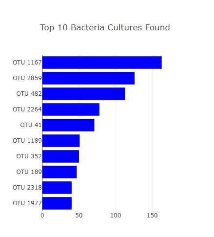
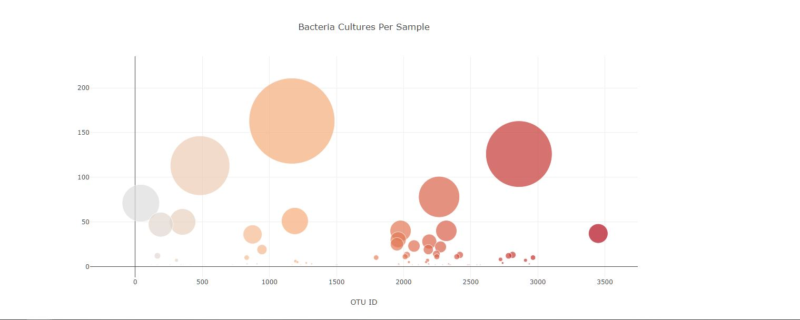

# Bellybutton_Biodiversity
The purpose of this project is to build a dashboard using data from a study of different bacteria found in people's belly buttons.The dataset reveals that a small handful of microbial species (also called operational taxonomic units, or OTUs, in the study) were present in more than 70% of people, while the rest were relatively rare.

[Web Page Link](https://shivam0921.github.io/Bellybutton_Biodiversity/)

